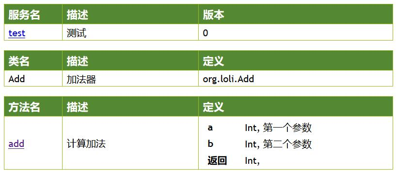
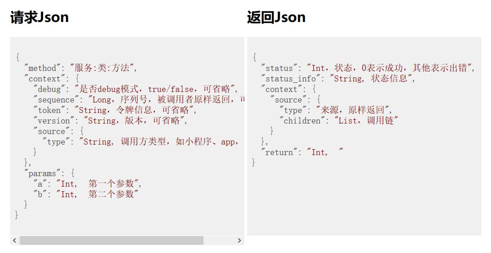
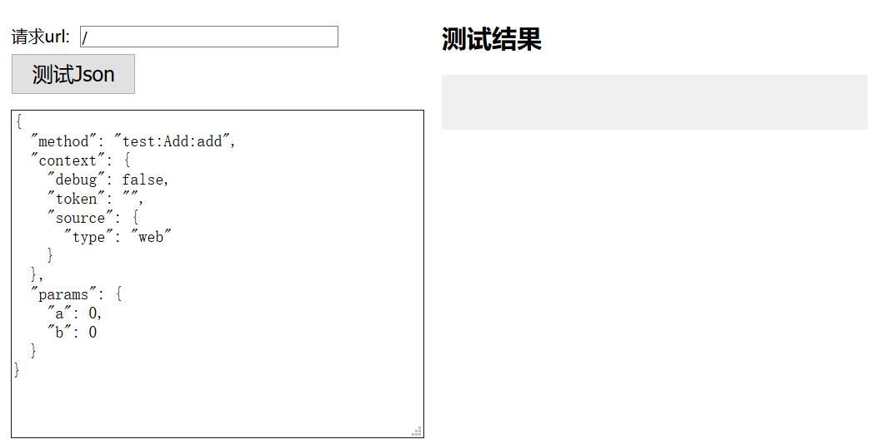
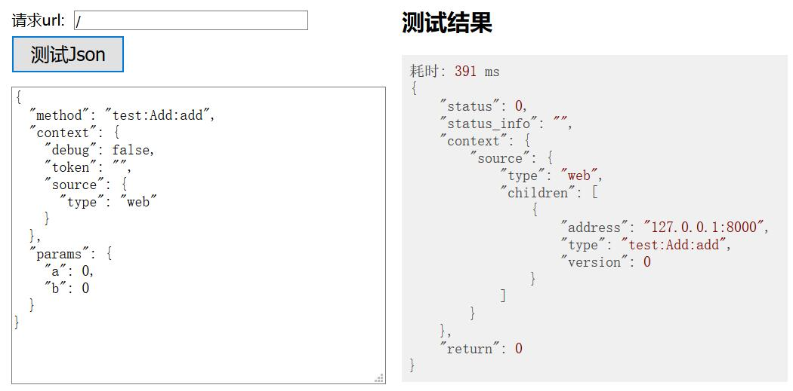

# Loli：基于kotlin的基础微服务构架
## 快速使用
1. 建立一个kotlin项目
2. 建立一个kt文件，写入如下内容：
```kotlin
@RpcExport("Add", "加法器")
@RpcAuth(false)
class Add : AbsRpc() {
    @RpcExport(desc = "计算加法")
    fun add(
        @RpcDesc("第一个参数") a: Int,
        @RpcDesc("第二个参数") b: Int
    ) = a + b
}

fun main() {
    // 注册rpc对外类
    RpcCall.register(Add::class)

    // 配置
    val conf = RpcConf("test", "测试", "127.0.0.1", 8000)

    // 启动服务
    StartRpcJson().start(conf)
}
```
最后启动main函数，在浏览器中输入：http://127.0.0.1:8000/explain，看到如下的界面：


点击类名，看到类定义页面为：



点击方法名，看到方法定义页面为：





点击最下面的【测试Json】按钮，就能看到rpc服务的调用结果：



### 简单说明
