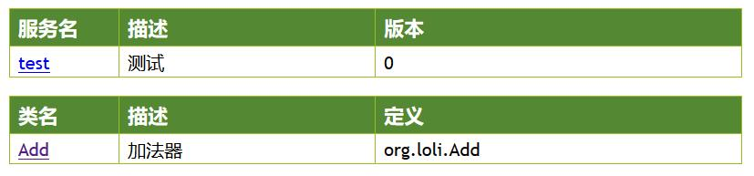

# Loli：基于kotlin的基础微服务构架
## 1、快速使用
1. 建立一个kotlin项目，引用loli-core，参考(build.gradle)：
```groovy
dependencies {
    compile "net.easy3w:loli-core:0.2"
}
```

2. 建立一个kt文件，写入如下内容：
```kotlin
@RpcExport("Add", "加法器")
@RpcAuth(false)
class Add : AbsRpc() {
    @RpcExport(desc = "计算加法")
    fun add(
        @RpcDesc("第一个参数") a: Int,
        @RpcDesc("第二个参数") b: Int
    ) = a + b
}

fun main() {
    // 注册rpc对外类
    RpcCall.register(Add::class)

    // 配置
    val conf = RpcConf("test", "测试", "127.0.0.1", 8000)

    // 启动服务
    StartRpcJson().start(conf)
}
```
最后启动main函数，在浏览器中输入：http://127.0.0.1:8000/explain

看到如下的界面：



点击类名，看到类定义页面为：


点击方法名，看到方法定义页面为：


点击最下面的【测试Json】按钮，就能看到rpc服务的调用结果：


### 简单说明
1. 服务启动后，会在指定host和port启动一个http的服务
2. 外界通过http的post模式发送json请求给本服务
3. 服务解析json请求，找到对应的方法并调用
4. 服务返回方法的调用结果给用户(json)

## 10、性能测试结果
```text
性能测试结果
设备：8核，32G，centos7
2台设备，1台部署1个srv，1台部署1个api

1、api+srv 2层组合
测试命令：ab -n 1000000 -c 10000 -p post -T "application/json" http://127.0.0.1:9900/
QPS：8k
测试命令：ab -n 1000000 -c 10000 -p post -T "application/json" -k http://127.0.0.1:9900/
QPS：11k
这里-k表示keep-alive。

2、单独srv层
测试命令：ab -n 1000000 -c 10000 -p post -T "application/json" http://127.0.0.1:9900/
QPS：18k
测试命令：ab -n 1000000 -c 10000 -p post -T "application/json" -k http://127.0.0.1:9900/
QPS：80k
这里-k表示keep-alive。 
```


